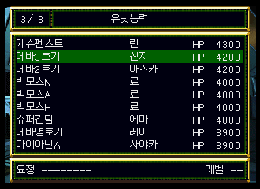
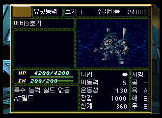
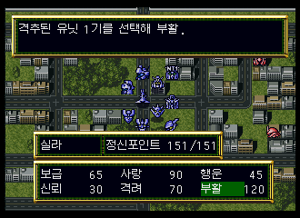
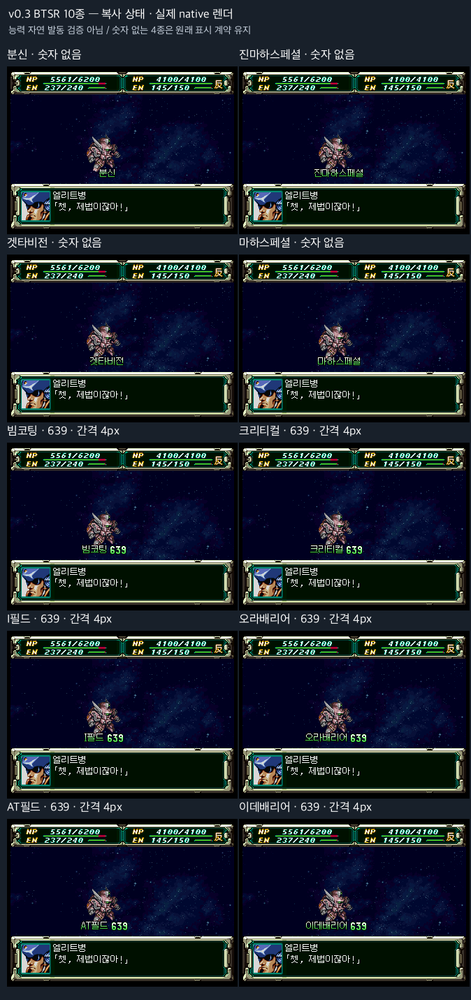
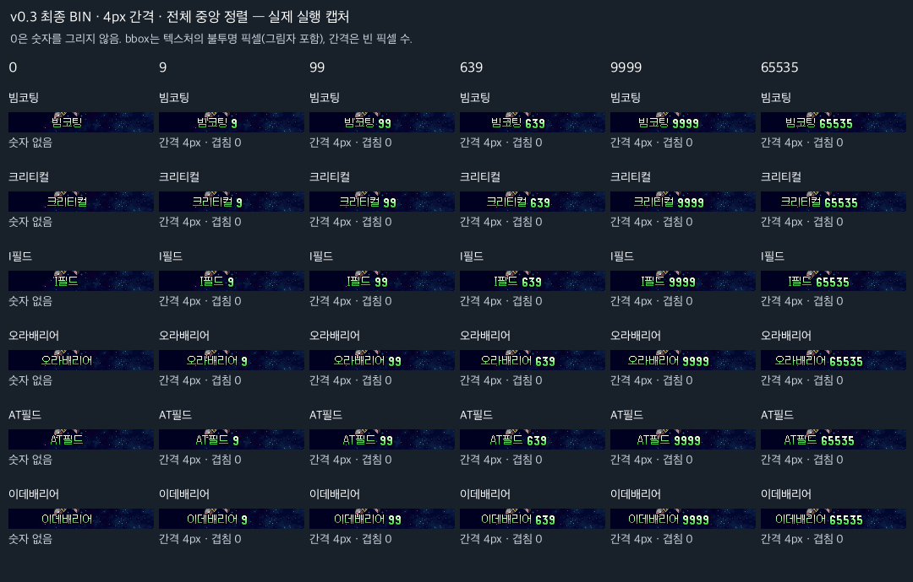

# 슈퍼로봇대전 F 완결편 v0.3 패치노트

2026.10.05 · a DOS thin / b 갈무리11 / c Mona12

충분히 검수가 되지 않은 마이너 패치이므로 게임 진행 중 카트리지 세이브를 수시로 부탁드립니다.

## 신지의 새 게임 초기 기체 배정 수정

새 게임의 기본 편성에서 신지가 G캐논 또는 에바 3호기로 잘못 배정되던 두 곳을 고쳐, 정상 기체인 에바 초호기로 배정되도록 복원했습니다. 신지의 레벨 20은 유지합니다. 이미 배정이 끝난 기존 진행 세이브를 자동으로 고치는 수정은 아닙니다.

기존 오류 사례: 유닛 목록에 에바 3호기와 신지가 함께 표시된 실제 진단 화면입니다.

위와 같은 수정 전 실행의 기체 상세 화면입니다. 에바 3호기 이름과 기체 이미지가 표시됩니다. 두 이미지는 잘못된 배정의 사례이며, 최종 v0.3의 수정 후 화면이 아닙니다. 최종 수정은 별도 실행 진단에서 신지의 레벨을 유지하며 기체 ID가 235에서 초호기 233으로 바뀌는 것을 확인했습니다.

## 부활 사용 시 암전하던 문제 수정

부활 대상을 고르는 목록을 열 때 화면이 검게 변하고 진행하지 못하던 문제를 수정했습니다. ‘부활 목록’의 글자 길이를 짧게 읽던 코드를 실제 길이에 맞췄습니다.

수정 전 대조 화면: 시라의 정신기 메뉴에서 부활을 선택한 상태입니다. 크리스에게도 같은 목록 표시 코드를 사용하는 문제입니다.

같은 대조 진단에서 부활 목록을 열다가 암전한 실제 캡처입니다. 복사 상태를 이용한 수정 진단에서는 대상 선택·부활 완료·지도 복귀 및 취소를 확인했습니다.

## 특수기능 이름과 숫자 사이 여백 개선

배리어·크리티컬처럼 숫자가 함께 표시되는 효과는 문구와 숫자 사이 간격을 조정했습니다. 분신 같은 회피 특수기는 이름만 표시됩니다. 숫자가 함께 표시되는 효과는 이름의 실제 글자 폭을 기준으로 숫자 앞에 4px 여백을 두고 전체 묶음을 가운데 정렬합니다. 숫자 자릿수가 달라져도 같은 기준으로 배치합니다.

통제 상태에서 최종 BIN의 코드를 읽어 실행한 실제 native 캡처입니다. 숫자 표시 6종과 이름만 표시하는 4종을 확인했습니다. 자연 전투에서 모든 기능이 발동한 기록은 아닙니다.

통제 상태에서 숫자 자릿수 경계를 확인했습니다. 표시되는 숫자는 그림자까지 포함한 실제 픽셀 사이의 빈 공간이 4px입니다.

## 특정 시나리오의 출격·증원 오류 수정

- **63화 「운명을 잣는 자들」 EVA 갈래:** 레이 출격 시 기체 위치가 잘못 지정된 문제를 수정했습니다.
- **78화 「파이널 오퍼레이션」 DC 루트:** 증원으로 등장하는 가자D의 EN·장갑·한계 개조 수치 오류를 수정했습니다. 두 증원 기록의 수치를 원판의 5/5/5로 복원했습니다.
- **74화 「거짓 협정」:** 아군 출격 시 모함 위치를 확인하는 데이터 오류를 수정했습니다. 해당 분기의 출격 결과에는 영향이 없습니다.
- **62화 「결전, 제2 신도쿄시」 후반 맵:** 레이 출격 시 기체 위치가 잘못 지정된 문제를 수정했습니다.

화수는 게임에 표시되는 누적 화수입니다. 완결편 기준으로 62화는 29화, 63화는 30화, 78화는 45화, 74화는 41화에 해당합니다. 최종 기체 위치는 지형이나 빈칸에 따라 달라질 수 있으며, 자연 플레이의 최종 배치·증원·이벤트 결과는 아직 검증하지 않았습니다. 이 항목의 실제 캡처는 없어 이미지를 붙이지 않았습니다.

## 확인 범위

이번 기록은 선별한 실행 진단과 데이터 검사 결과입니다. 전체 시나리오·장기 진행·모든 전투 연출 검증을 뜻하지 않습니다. 새 게임 기본 편성, 부활과 특수기능 표시는 위의 범위로 확인했으며, 추가 5곳은 자연 플레이 확인이 남아 있습니다.

배포 직전 추가 짧은 점검에서도 새 크래시를 발견하지 않았습니다. 저장 상태 없는 콜드부트 진행, 부활 완료·취소, 숫자 표시 후 반격 확정과 지도 복귀를 확인했습니다. 장시간 전체 시나리오 검증을 뜻하지 않습니다.

폰트 선택 복원: a DOS thin·b 갈무리11에도 동일한 v0.3 수정을 반영했습니다. a/b 대표 표시 18건에서 숫자와 문구 사이 4px을 확인했고, 별도 저장 상태 없는 부팅에서 실제 글꼴 차이를 확인했습니다. 위 특수기능 검수 이미지는 기존 c 실행 자료입니다. a/b의 음성·전체 시나리오·장기 진행·CD-R·사용자 R7는 미검증입니다.
